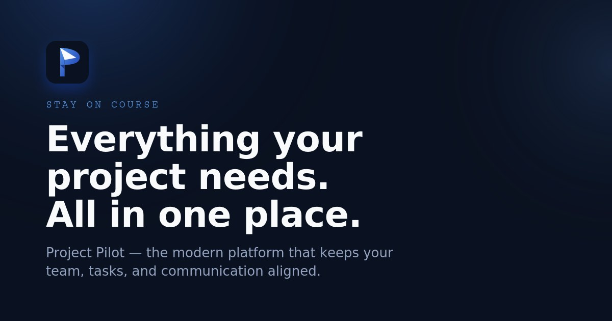

<p align="center">
  
</p>

<h1 align="center">
   Project Pilot
</h1>

<p align="center"><b>Stay on course.</b> Everything your project needs, all in one place.</p>

<p align="center">
  <a href="https://project-pilot-1n5w.onrender.com"><b>🚀 Open the live app</b></a> ·
  <a href="https://welcomeaboard.netlify.app/"><b>🌐 Marketing website</b></a> ·
  <a href="https://welcomeaboard.netlify.app/feedback.html"><b>💬 Feedback</b></a>
</p>

---

Project Pilot is a full-stack project management platform: plan projects, break them into milestones, assign and track tasks, collaborate with a team through comments and real-time notifications, and control exactly who can do what — all enforced on the server, not just hidden in the UI.

<br>

## What is Project Pilot?

Scattered docs, half-updated spreadsheets, and a group chat nobody can scroll back through — Project Pilot gives every project a single, shared source of truth instead.

It's built for small crews working together on something with a deadline: student project groups, startups, or any small team that needs projects, tasks, roles, and communication in one connected place rather than five different apps.

Each project is broken into **milestones** with their own tasks, priorities, and due dates. Every member gets a role — **Owner**, **Admin**, or **Member** — and the owner decides exactly which of those roles can create tasks, manage milestones, approve join requests, or edit project settings.

<br>

## Key features

<table>
<tr>
<td width="50%" valign="top">

**Projects & milestones**
- Create projects from ready-made templates (Blank, Presentation, Research, School assignment, Startup, Event, Personal project) or start from scratch
- Break work into milestones with titles, descriptions, and due dates
- Project color, icon, objective, archive, and discoverability settings

**Tasks**
- Status, priority, and an "important" flag per task
- Due dates and multiple assignees per task (a task can belong to more than one person)
- Threaded comments on every task
- Personal task pinning, independent per team member

</td>
<td width="50%" valign="top">

**Team & roles**
- Owner / Admin / Member roles per project
- Fine-grained, per-project permissions (creating/editing/deleting tasks, managing milestones, members, join requests, project settings, and resources)
- Discoverable projects with join requests, or fully private projects

**Notifications & activity**
- Real-time in-app notifications over Server-Sent Events
- Per-user notification preferences (task due dates, new followers, email notifications)
- Project activity feed and a personal activity timeline

</td>
</tr>
<tr>
<td width="50%" valign="top">

**Profiles & social**
- Public/private user profiles with avatar, motto, and location
- Follow other users, with follower/following lists
- Join requests to discoverable projects

</td>
<td width="50%" valign="top">

**Resources & account**
- Link-based resources per project (name, description, URL)
- Light/dark theme and Czech/English language toggle
- Email verification, password reset by emailed code, and account deactivation/deletion (password re-confirmation required)

</td>
</tr>
</table>

<br>

## How it works

1. **Chart the route** — create a project from a template and break it into milestones, each holding its own tasks with a priority and a due date.
2. **Assemble the crew** — invite teammates and assign them Owner, Admin, or Member roles, deciding exactly who can create tasks, manage milestones, or approve join requests.
3. **Stay in contact** — comments on tasks and a real-time activity/notification feed keep everyone aligned without a separate group chat.
4. **Land safely** — every permission check happens server-side, and destructive actions (like deleting a project or your account) require an explicit confirmation step.

<br>

## Technology / Tech stack

| Layer | Technologies |
|---|---|
| **Frontend** | React 19 + TypeScript, Vite, React Router 7, Zustand (state management), Tailwind CSS 4, Recharts |
| **Backend** | Node.js + Express 5 + TypeScript, JWT (`jsonwebtoken`) authentication, `bcryptjs` password hashing, Server-Sent Events for real-time updates |
| **Database** | **SQLite** (via `node:sqlite`) for local development, **PostgreSQL** (via `pg`) in production — selected automatically based on whether `DATABASE_URL` is set |
| **Email** | [Resend](https://resend.com) API for verification codes, password resets, and welcome emails (falls back to console logging in development if no API key is set) |
| **Marketing website** | Static HTML/CSS/JavaScript, hosted separately on Netlify |

<br>

## Architecture

Project Pilot is a monorepo-style project with three independent parts:

- **`server/backend`** — an Express + TypeScript REST API under `/api/*`, backed by a small database abstraction layer that exposes the same `get / all / run / exec / transaction` interface for both SQLite and PostgreSQL. Routes write SQL once, and the adapter translates it to the right dialect underneath.
- **`server/frontend`** — a React + TypeScript single-page application that talks to the API.
- **`marketing-site`** — a separate static marketing website, unrelated to the app's source code, deployed independently.

In **production**, the backend also serves the built frontend (`frontend/dist`) as static files with an SPA fallback, so the whole application runs as a **single deployed service**. In **development**, the frontend runs on its own Vite dev server and proxies `/api` requests to the backend.

Real-time notifications are pushed over Server-Sent Events, tracked in an in-memory registry of connected clients per user.

<br>

## Project structure

```
project-pilot/
├── marketing-site/           # Static marketing website (separate from the app)
│   ├── index.html
│   └── feedback.html
└── server/
    ├── backend/               # Express + TypeScript REST API
    │   └── src/
    │       ├── db/            # SQLite/Postgres abstraction, schema, project templates
    │       ├── lib/           # Mailer (Resend), notifications, permissions, realtime (SSE)
    │       ├── middleware/    # JWT auth middleware
    │       ├── routes/        # auth, projects, tasks, milestones, users, follows, notifications, resources
    │       └── scripts/       # One-off SQLite → PostgreSQL migration script
    └── frontend/               # React + TypeScript single-page app
        └── src/
            ├── components/    # TaskBoard, ActivityTimeline, NotificationsBell, ProjectSettingsModal, ...
            ├── pages/         # Dashboard, ProjectPage, AuthPage, SettingsPage, ProfilePage, ...
            ├── store/         # Zustand stores (auth, theme)
            └── lib/           # API client, i18n, shared types
```

<br>

## Running locally

### Development

```
# 1. Backend API (defaults to a local SQLite database, no setup required)
cd server/backend
npm install
npm run dev

# 2. Frontend (in a separate terminal)
cd server/frontend
npm install
npm run dev
```

The backend starts on `http://localhost:4000` and the frontend's Vite dev server proxies all `/api` requests to it automatically. Open the URL that Vite prints in your terminal (typically `http://localhost:5173`).

### Production build

```
# Build the frontend
cd server/frontend
npm install
npm run build

# Build and start the backend (also serves the built frontend)
cd server/backend
npm install
npm run build
npm start
```

With `frontend/dist` present, the backend serves the compiled frontend and the API from the same process/port — the two are deployed as a single service.

<br>

## Environment variables

The backend reads configuration from environment variables. **Never commit real values** — this is a safe `.env.example` showing which variables exist and what they're for, without any real credentials:

```env
# Port the Express server listens on
PORT=4000

# PostgreSQL connection string. If set, the backend uses PostgreSQL.
# If left unset, it falls back to a local SQLite file automatically.
DATABASE_URL=

# Optional custom path for the local SQLite file (used only when DATABASE_URL is not set)
DATABASE_PATH=

# Set to "false" to disable SSL when connecting to PostgreSQL
DATABASE_SSL=

# Secret used to sign and verify JWT authentication tokens
JWT_SECRET=

# API key for the Resend email service.
# If omitted, emails are only logged to the server console (useful for local dev).
RESEND_API_KEY=

# "From" address used for outgoing emails
EMAIL_FROM=
```

`SQLITE_SOURCE_PATH` is an additional, optional variable used only by the one-off `migrate:sqlite-to-postgres` script when migrating local data into PostgreSQL.

<br>

## Deployment

- The **application** (backend + built frontend, served together as a single service) is deployed on **Render**.
- The **marketing website** is a separate static site, deployed independently on **Netlify**.
- Locally, the backend defaults to a bundled SQLite file for convenience. In production, `DATABASE_URL` is set to point at a managed PostgreSQL database instead — since typical hosting platforms use an ephemeral filesystem, a persistent external database is required so data survives redeploys and restarts. A dedicated migration script (`migrate:sqlite-to-postgres`) moves existing SQLite data into PostgreSQL while preserving IDs and foreign key relationships.

<br>

## Project status

Project Pilot is **live and functional** — you can create an account and use it today at the link below. It's an actively developed personal project, with the backend, frontend, and database layer all implemented and working end-to-end.

<br>

## License

Project Pilot is licensed under the GNU Affero General Public License v3.0.
See the [LICENSE](LICENSE) file for details.

<br>

## Links

- 🚀 **Live app** — [project-pilot-1n5w.onrender.com](https://project-pilot-1n5w.onrender.com)
- 🌐 **Marketing website** — [welcomeaboard.netlify.app](https://welcomeaboard.netlify.app/)
- 💬 **Feedback** — [welcomeaboard.netlify.app/feedback.html](https://welcomeaboard.netlify.app/feedback.html)
- 👤 **Author** — [milanfridrich.is-a.dev](https://milanfridrich.is-a.dev)

---

<p align="center">
  Project Pilot — Stay on course.<br>
  © 2026 <a href="https://milanfridrich.is-a.dev">Milan Fridrich</a>
</p>